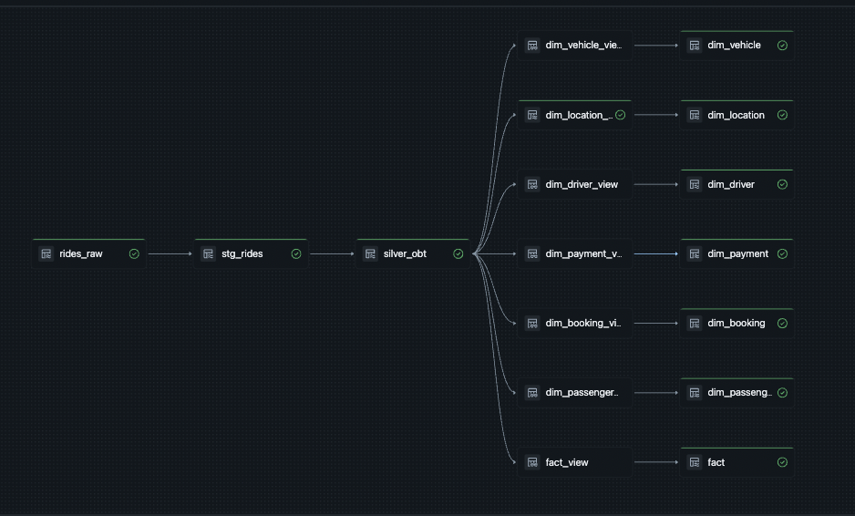

# 🚖 Real-Time Uber Analytics Platform using Databricks Lakehouse

## Project Overview

This project implements a **real-time Uber analytics system** designed to process ride data and prepare analytics-ready datasets for dashboards and business reporting.

The objective is to build a scalable data platform where Uber ride events are generated, streamed, transformed, and modeled into structured datasets that can be consumed for analytics.

The solution follows the **Databricks Lakehouse Architecture** and **Medallion Architecture (Bronze, Silver, and Gold layers)** to organize data processing, improve data quality, and support scalable analytics.


---

# Data Flow Architecture

The pipeline starts with a FastAPI application that generates Uber ride booking events. These events contain information such as passenger details, driver details, vehicle information, payment details, location information, and ride metrics.

The generated events are published to **Azure Event Hubs** using the Kafka protocol. Databricks consumes these streaming events using **Structured Streaming** and processes the data through different transformation layers.

The overall data flow is:

```text
FastAPI Event Producer
          |
          v
Azure Event Hubs (Kafka)
          |
          v
Databricks Structured Streaming
          |
          v
Bronze Layer
(Raw Delta Tables)
          |
          v
Staging Layer
(Schema Enforcement & Parsing)
          |
          v
Silver Layer
(Enriched One Big Table)
          |
          v
Gold Layer
(Fact & Dimension Tables)
          |
          v
Analytics Dashboard
```

The complete Databricks pipeline implementation is shown below:

# Medallion Architecture Implementation

## 🥉 Bronze Layer – Raw Data Ingestion

The Bronze layer stores raw data received from both streaming and historical sources.

Streaming ride events are consumed from Azure Event Hubs using Databricks Structured Streaming and stored as Delta tables.

Historical datasets such as vehicle details, payment methods, cities, ride statuses, cancellation reasons, and bulk ride data are loaded from Azure storage into Bronze tables.

This layer maintains the original data for traceability and supports reliable downstream processing.

---

## 🥈 Silver Layer – Data Transformation and Enrichment

The Silver layer performs data cleaning, validation, and transformation.

The staging process includes:

* Parsing JSON streaming events.
* Applying schema enforcement.
* Performing data type conversions.
* Combining historical and streaming ride data.

The processed ride data is enriched by joining with reference datasets such as:

* Vehicle information
* Payment details
* Ride status
* Location details
* Cancellation reasons

The output is an enriched **One Big Table (OBT)** containing all required information for analytics.

---

## 🥇 Gold Layer – Analytics Data Model

The Gold layer provides analytics-ready datasets using a **Star Schema design**.

Dimension tables include:

* Passenger
* Driver
* Vehicle
* Payment
* Booking
* Location

The fact table contains ride-level metrics such as:

* Distance
* Duration
* Fare
* Tip amount
* Rating

Auto CDC is implemented to manage changing data using:

* **SCD Type 1** for maintaining the latest records.
* **SCD Type 2** for preserving historical changes.

---


---

# Final Outcome

The completed platform provides a scalable real-time Uber analytics solution that:

* Processes live and historical ride data.
* Uses Databricks Lakehouse architecture for scalable data processing.
* Implements Medallion Architecture for structured data management.
* Creates optimized fact and dimension tables for analytics.
* Provides a strong foundation for dashboards and business insights.

The project demonstrates an end-to-end modern data engineering pipeline using **Azure Event Hubs, Kafka, Databricks Structured Streaming, Delta Lake, PySpark, and Lakeflow Declarative Pipelines**.
